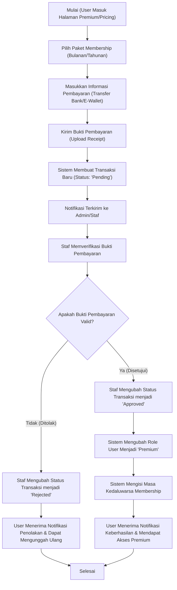
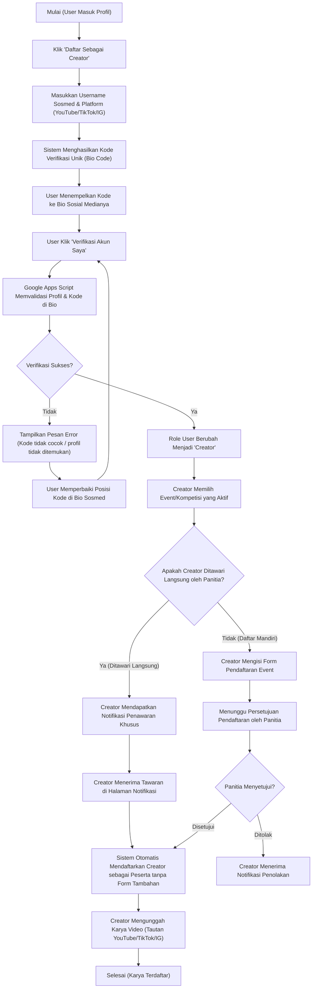
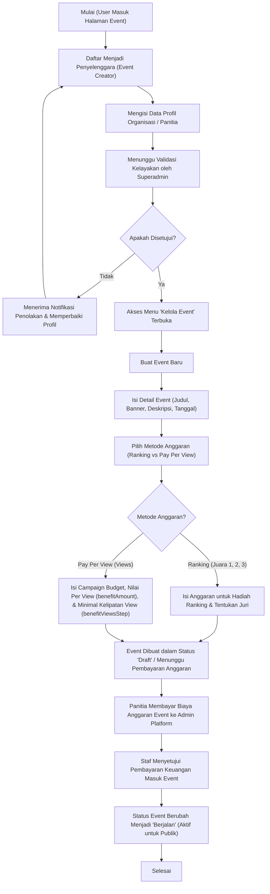
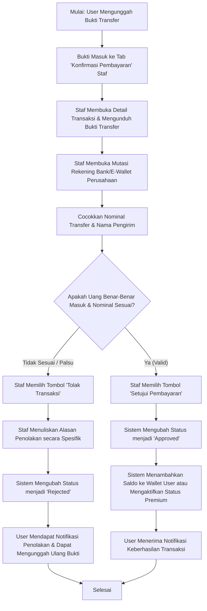
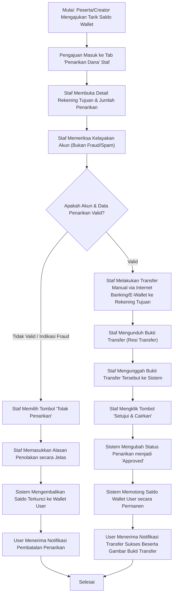

# Bagan Alur Sistem (System Flowcharts)

Dokumen ini berisi flowchart alur sistem dari berbagai sisi pengguna di dalam platform **Portal Movie / Portal Konten**.

---

## 1. Alur User Menjadi Member Premium

Alur proses dari saat user biasa melakukan transaksi peningkatan akun hingga menjadi status Premium.

---

## 2. Alur Pendaftaran Content Creator & Peserta Event

Proses ketika pengguna mendaftar sebagai pembuat konten, dilanjutkan dengan mendaftar ke suatu kompetisi/event.

---

## 3. Alur Pendaftaran Event Creator & Pembuatan Event

Proses bagi penyelenggara untuk mendaftar sebagai pembuat event dan merilis kompetisi baru.

---

## 4. Alur Validasi Staf - Keuangan Masuk (Deposit & Membership)

Proses kerja staf internal dalam memverifikasi dan menyetujui transaksi dana masuk dari pengguna (deposit saldo atau pendaftaran membership premium).

---

## 5. Alur Validasi Staf - Keuangan Keluar (Penarikan Dana / Withdrawals)

Proses verifikasi, transfer manual, hingga penyelesaian pembayaran keluar oleh staf untuk pencairan saldo dompet peserta/creator.

