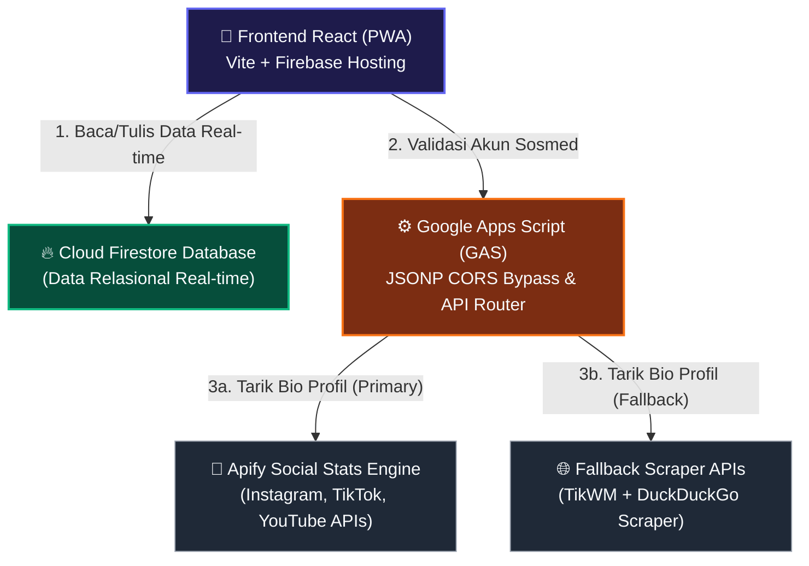
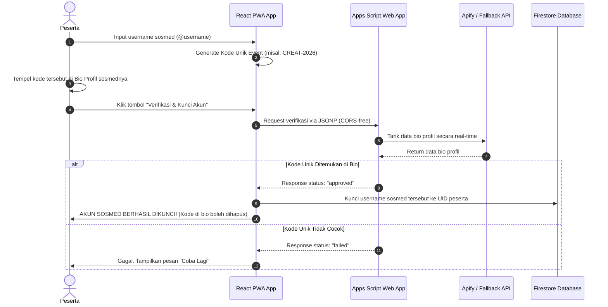

# Arsitektur & Gambaran Umum Sistem: JAMKOSONG
**Ekosistem Terbuka Marketplace Event, Distribusi Film (Revenue-Share), & Otomasi Iklan Kreator (Creator Ad Pool)**

---

## 🗺️ 1. Diagram Arsitektur Hubungan Sistem (System Topology)
Sistem ini dirancang menggunakan arsitektur **Serverless Modern** yang sangat efisien, menghubungkan aplikasi PWA Frontend dengan Database Cloud dan Layanan Mikro-Verifikasi Pihak Ketiga:



---

## 📑 2. Arsitektur Data & Model Firestore (Database Schema)
Untuk mendukung sistem pembuatan event terbuka, bagi hasil film, dan kampanye *Ad Pool*, Firestore diorganisasikan ke dalam struktur koleksi berikut:

### **A. Koleksi `users` (Manajemen Pengguna)**
```json
{
  "uid": "user_98213",
  "username": "kreator_muda",
  "email": "kreator@jamkosong.com",
  "role": "member", // 'member' (premium), 'pro', 'staf', 'superadmin', 'guest'
  "premiumExpiresAt": 1789437200000, // Unix timestamp kadaluarsa premium
  "linkedHandles": {
    "instagram": "@kreator_ig", // Akun yang sudah divalidasi dan dikunci
    "tiktok": "@kreator_tiktok",
    "youtube": "kreatorchannelyt"
  }
}
```

### **B. Koleksi `movies` (Distribusi Film & Bagi Hasil)**
```json
{
  "id": "laskar-pelangi-2026",
  "title": "Laskar Pelangi New Edition",
  "creatorId": "sineas_lokal_01", // ID Akun Sineas Pemilik Film
  "revenueSharePercent": 70, // Persentase bagi hasil untuk Sineas (70%)
  "watchTimeMinutes": 14200, // Total akumulasi menit tontonan pengguna premium
  "videoUrl": "https://storage.googleapis.com/movie-bucket/laskar-pelangi.mp4"
}
```

### **C. Koleksi `events` (Marketplace Event & Kampanye Iklan)**
```json
{
  "id": "event_creative_cpm_2026",
  "title": "Digital Creative Campaign",
  "organizerId": "brand_indonesia", // ID Pembuat Event (EO / Brand)
  "adminFeePaid": 250000, // Tarif admin pembuatan event terbuka
  "eventType": "sponsored_ad_pool", // 'sponsored_ad_pool' atau 'normal_competition'
  "adPoolBudget": 5000000, // Total anggaran iklan untuk kreator
  "cpmRate": 10000, // Pembayaran Rp 10.000 per 1.000 views karya peserta
  "maxParticipants": 100,
  "uniqueCode": "CREAT-2026" // Kode unik untuk verifikasi bio kepemilikan akun
}
```

### **D. Koleksi `eventParticipants` (Pendaftaran & Monitoring Karya)**
```json
{
  "id": "part_991823",
  "eventId": "event_creative_cpm_2026",
  "participantUid": "user_98213",
  "lockedSocialPlatform": "instagram", // Platform sosmed yang sudah dikunci
  "lockedSocialHandle": "@kreator_ig", // Username sosmed terkunci
  "submissionLink": "https://instagram.com/p/C-karya-kreator", // Link postingan karya
  "viewsCount": 15200, // Jumlah views karya yang terdeteksi
  "payoutEarned": 152000, // Pendapatan peserta (15.2K views * CPM Rate 10rb / 1K)
  "status": "approved"
}
```

---

## 🔄 3. Alur Kerja Teknis Dua Tahap (Two-Stage Event Flow)

Sistem pendaftaran event Jamkosong dibagi menjadi dua tahap terpisah demi meminimalisir kecurangan dan otomatisasi kerja panitia:

### **Tahap 1: Pembuktian Kepemilikan & Kunci Akun Sosial Media**
Peserta mendaftarkan akun sosial media mereka ke dalam event dengan menempelkan kode unik di bio mereka untuk divalidasi oleh sistem:



### **Tahap 2: Pengiriman Karya & Perhitungan Ad Pool (CPM)**
Setelah akun terkunci, peserta memposting karya mereka di akun tersebut dan sistem menghitung bagi hasil iklannya:
1.  **Posting**: Peserta membuat postingan karya promosi produk sponsor di akun sosial media yang telah terkunci di Tahap 1.
2.  **Submit**: Peserta mengirimkan tautan (*submissionLink*) karya tersebut ke portal.
3.  **Audit**: Sistem memvalidasi bahwa tautan karya yang dikirimkan **wajib berasal dari username yang telah terkunci** di database. Peserta tidak bisa mengirimkan link karya milik orang lain.
4.  **Payout**: Sistem mengaudit jumlah views postingan secara real-time, lalu membagikan anggaran *Ad Pool* kepada peserta berdasarkan performa CPM yang telah ditetapkan brand (misal: Rp 10.000 per 1.000 views).

---

## 🔗 4. Jalur Penyeberangan CORS (JSONP Bridge)
Untuk menghindari hambatan keamanan peramban (*CORS Block*) saat melakukan permintaan silang dari klien ke API Google Apps Script, platform ini menggunakan sistem callback dinamis (**JSONP**):
*   Aplikasi frontend menyisipkan tag `<script>` baru ke dalam dokumen HTML secara dinamis yang mengarah ke URL Apps Script dengan menyertakan parameter `callback=jsonp_callback_XXXXX`.
*   Google Apps Script merespons dengan membungkus objek JSON evaluasi dalam fungsi callback tersebut (contoh: `jsonp_callback_XXXXX({"exists": true, "codeFound": true, "status": "approved"})`).
*   Browser mengeksekusi script tersebut, memicu fungsi resolver lokal, dan kemudian menghapus kembali tag `<script>` yang telah disisipkan untuk menjaga kebersihan DOM.
